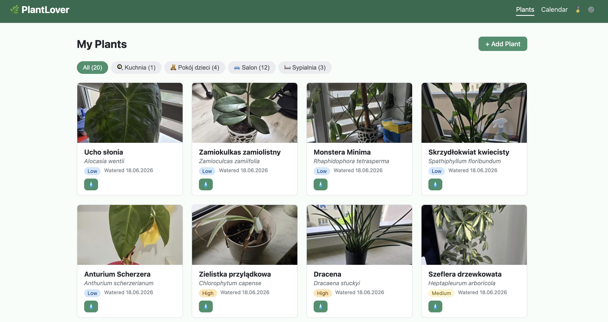

# PlantLover

A full-stack plant management app. Track your plants, log care events, and identify species via the PlantNet API.



## Stack

- **Backend**: FastAPI + SQLAlchemy 2 + Alembic + PostgreSQL
- **Frontend**: React 18 + Vite + TypeScript + React Router
- **Database**: PostgreSQL 16 (via Docker)

## Requirements

| Tool       | Version  | Notes                                                         |
|------------|----------|---------------------------------------------------------------|
| Python     | 3.11+    | [python.org](https://python.org)                             |
| Node.js    | 18+      | [nodejs.org](https://nodejs.org)                             |
| Docker     | any      | [docs.docker.com/get-docker](https://docs.docker.com/get-docker) |

## Quick Install

```bash
git clone https://github.com/lukaszgdk/plantlover.git
cd plantlover
chmod +x install.sh
./install.sh
```

The script will:

1. Start a PostgreSQL container via Docker Compose
2. Create a Python virtual environment and install backend dependencies
3. Run Alembic database migrations
4. Build the frontend

## Manual Setup

### 1. Start PostgreSQL

```bash
docker compose up -d
```

### 2. Backend

```bash
cd backend

python3 -m venv .venv
source .venv/bin/activate   # Windows: .venv\Scripts\activate

pip install -r requirements.txt

cp .env.example .env        # edit if needed

alembic upgrade head

uvicorn app.main:app --reload
# → http://localhost:8000
# → http://localhost:8000/docs  (Swagger UI)
```

### 3. Frontend

```bash
cd frontend

npm install
npm run dev
# → http://localhost:5173
```

## Environment Variables

Copy `backend/.env.example` to `backend/.env` and adjust as needed.

| Variable            | Required | Description                                     |
|---------------------|----------|-------------------------------------------------|
| `DATABASE_URL`      | yes      | PostgreSQL connection string                    |
| `PLANTNET_API_KEY`  | no       | API key for species identification (plantnet.org) |

## Project Structure

```text
plantlover/
├── backend/
│   ├── app/
│   │   ├── main.py        # FastAPI app + CORS
│   │   ├── database.py    # SQLAlchemy engine + session
│   │   ├── models.py      # ORM models
│   │   ├── schemas.py     # Pydantic v2 schemas
│   │   └── routers/       # API route handlers
│   ├── alembic/           # Database migrations
│   ├── alembic.ini
│   ├── requirements.txt
│   └── .env.example
├── frontend/
│   └── src/
│       ├── api/           # Typed fetch client
│       ├── types/         # TypeScript types
│       └── components/    # React components
├── docker-compose.yml
└── install.sh
```

## API Endpoints

| Method | Path                       | Description               |
|--------|----------------------------|---------------------------|
| GET    | /plants                    | List all plants           |
| POST   | /plants                    | Create a plant            |
| GET    | /plants/{id}               | Get one plant             |
| PUT    | /plants/{id}               | Update a plant            |
| DELETE | /plants/{id}               | Delete a plant            |
| POST   | /plants/{id}/identify      | Identify species          |
| POST   | /plants/{id}/care-log      | Log a care event          |

## Updating (LXC template)

If you're running the standalone LXC template, use the built-in update script:

```bash
plantlover-update
```
